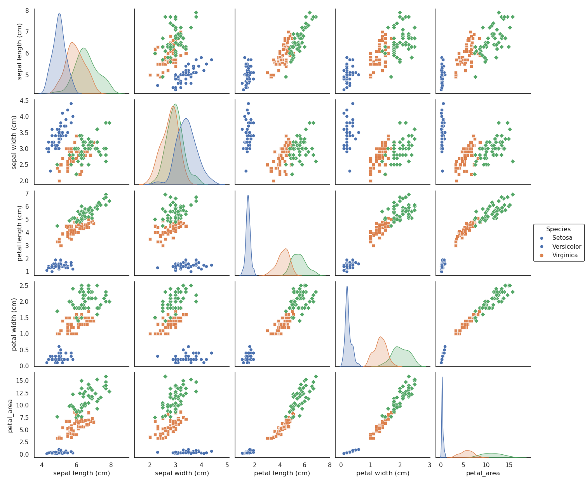

# Flower-Species Classifier

[](https://github.com/shaolinpat/flower_classifier/actions/workflows/ci.yml)
[](https://codecov.io/gh/shaolinpat/flower_classifier)  
[](https://www.python.org/downloads/release/python-3110/)
[](LICENSE)
[](https://colab.research.google.com/github/shaolinpat/flower_classifier/blob/main/notebooks/flower_classifier.ipynb)


An end-to-end Iris-dataset classifier with EDA, 8 models, SHAP interpretation, and a Streamlit UI.

## Table of Contents

- [Overview](#overview)
- [Key Results](#key-results)
- [Visual Highlights](#visual-highlights)
- [Features](#features)
- [Quick Start](#quick-start)
- [Launch Streamlit](#launch-the-streamlit-app)
- [Quick Verify](#quick-verify)
- [File Layout](#file-layout)
- [Next Steps](#next-steps)
- [License](#license)


## Overview

A compact end-to-end machine-learning project that:

1. Explores the classic **Iris** dataset (150 samples, 4 numeric features, 3 species)  
2. Benchmarks **8 traditional classifiers** with hyper-parameter search  
3. Interprets the winning model with **SHAP**  
4. Saves the best pipeline and serves it through a **Streamlit** app  

---

## Key Results

While Support Vector Machines (SVM) achieved the highest cross-validated F1 score (0.975),  
k-Nearest Neighbors (k-NN) obtained the best test set accuracy (96.7%) on the held-out data.

This suggests both models are strong candidates, with SVM showing slightly more consistent generalization.


- **Best model**: Support Vector Machines (SVM)  
  - Cross-validated accuracy: **96.7% ± 2.1%**
  - Test set accuracy: **93%**
  - Macro F1-score on test set: **0.93**

- **Per-class performance on test set**:
  | Class       | Precision | Recall | F1-score |
  |-------------|-----------|--------|----------|
  | Setosa      | 1.00      | 1.00   | 1.00     |
  | Versicolor  | 0.90      | 0.90   | 0.90     |
  | Virginica   | 0.90      | 0.90   | 0.90     |

- **Model comparison (cross-validation results)**:
  | Model                  | CV Accuracy | Std Dev |
  |------------------------|-------------|---------|
  | Logistic Regression    | 0.960       | 0.039   |
  | k-Nearest Neighbors    | 0.960       | 0.025   |
  | Decision Tree          | 0.953       | 0.034   |
  | Random Forest          | 0.960       | 0.025   |
  | **Support Vector Machine** | **0.967**   | **0.021** |
  | Naive Bayes            | 0.953       | 0.027   |
  | Gradient Boosting      | 0.960       | 0.033   |
  | Multi-layer Perceptron | 0.667       | 0.178   |

- **Interpretability**: SHAP visualizations explain feature impact on SVM predictions.

---

## Visual Highlights



*Figure: Pairwise scatter plots of Iris features showing clear separation among species.*


*Figure: Confusion matrix of the best model (SVM)*


*Figure: SHAP summary plot highlighting the most important features influencing predictions.*


*Figure: Test accuracy of all classifiers on the held-out test set. k-NN achieved the highest test accuracy (96.7%), while SVM led on cross-validated F1.*


---

## Features 
- Exploratory Data Analysis (EDA) with visualizations of Iris dataset
- 100% test coverage with pytest and GitHub Actions
- 8 trained classifiers compared (SVM, KNN, Logistic Regression, etc.)
- Best model selection based on cross-validated accuracy
- Model interpretability using SHAP (feature importance plots)
- Streamlit web app for live flower species prediction
- Joblib model export and cache directory setup
- Modular project layout with setup.py, requirements.txt, and environment.yml
- Colab-compatible notebook with preloaded model

---
## Quick Start
_(Run each command below at the command line, not inside Python or Jupyter)_

### Run in Google Colab
Try it now with no setup:

[](https://colab.research.google.com/github/shaolinpat/flower_classifier/blob/main/notebooks/flower_classifier.ipynb)


### Run Locally with Conda

### 1. Clone this repo
```bash
git clone git@github.com:shaolinpat/flower_classifier.git  
cd flower_classifier  
```

### 2. Create and activate the environment

```bash
conda env create -f environment.yml
conda activate iris
bash scripts/register_kernel.sh
```

### 3. Launch the notebook
```bash
# Option 1: Run the notebook in your default web browser
jupyter notebook notebooks/flower_classifier.ipynb

# Option 2: Open it directly in VS Code (if installed and in your PATH)
code notebooks/flower_classifier.ipynb
```

---

## Launch the Streamlit app
_(Run the command below at the command line)_
```bash
streamlit run scripts/streamlit_app.py
```

---

## Quick Verify

To make sure everything runs end-to-end.

_(Run the command below at the command line)_
```bash
scripts/verify_run.sh
```

---

## File Layout

```text
flower_classifier/
├── flower_classifier/ # Python package
│ ├── init.py
│ └── data_prep.py
├── images
│ ├── confusion_matrix.pngy
│ ├── model_comparison_highlighted.png
│ ├── pairplot.png
│ └── shap_summary.png
├── notebooks/
│ └── flower_classifier.ipynb
├── scripts/
│ ├── flower_classifier_app.py
│ ├── health_check.sh
│ └── badges.txt
├── tests/
│ └── test_data_prep.py
├── models/ # .gitignored, but running the notebook will recreate them
├── .github/
│ └── workflows/
│ └── ci.yml
├── .gitignore
├── README.md
├── LICENSE
├── requirements.txt
├── environment.yml
└── setup.py
```

---

## Next Steps

- **Testing Enhancements**  
  - Expand `pytest` coverage for data transformation, model loading, and inference paths  
  - Optionally add mocked tests for Streamlit routing and input handling

- **Visualization & Documentation**  
  - Add more visual examples (e.g., Shap beeswarm, yellowbrick classification report)  
  - Improve inline comments and function docstrings for maintainability  
  - Consider modularizing parts of the notebook into standalone Python scripts

- **Deployment & Packaging Improvements**  
  - Add CLI interface using `argparse` for batch predictions  
  - Create a `Dockerfile` for containerized builds and consistent deployment  
  - (Optional) Upload a demo video or GIF to README to showcase usage visually

- **Streamlit & Colab UX**  
  - Refine Streamlit UI with better validation and help text  
  - Maintain Colab compatibility using a lightweight `requirements-colab.txt`

- **Stretch Goals**  
  - Host the Streamlit app on Streamlit Community Cloud for live demos  
  - Add automatic model versioning or retraining hooks
---

## 📝 License

This project is licensed under the [MIT License](LICENSE).


*Built with scikit-learn 1.6 · Streamlit 1.33 · Python 3.11*